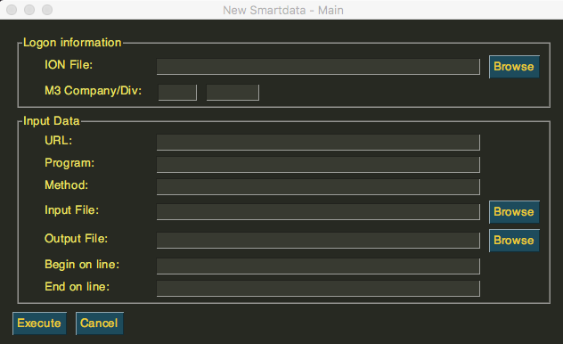
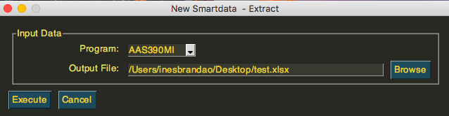

--------------
New Smartdata
--------------

The **New Smartdata Tool** is a Python3 app and its purpose is to efficiently execute the Data Loading, from external systems to the *M3 Cloud platform*. It all happens via **Infor ION** (Intelligent Open Network), which simplifies software integration and easily integrates entreprise systems. 

This software installation will simply provide an intuitive Data Loading Workspace, where the **Extract, Transfer and Load (ETL)** can be performed. In order to get started with the **NewSmartdata Tool**, just install it.

------------------
New Smartdata App
------------------

After installing the **New Smartdata Tool App** a new window will appear, as shown below. The main purpose is to be able to execute commands according to the desired Logon information and Input Data. In the Logon Information it is essential that you specify which M3 company and division you are working on. 

Nevertheless, there are various commands available at the upper screen of your MacOs (as shown below), where you can *extract, load or merge* data files.

As an example we can extract data by just choosing the program type and browsing into your computer to allocate the desired output file. That means, the main process of retrieving data out of the program source to an output file will be executed.

----------------
Current Status
----------------

