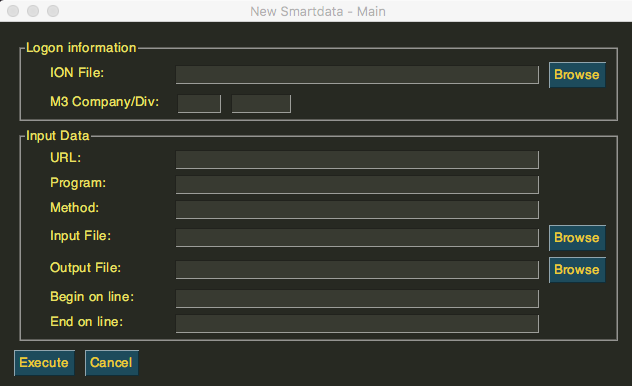
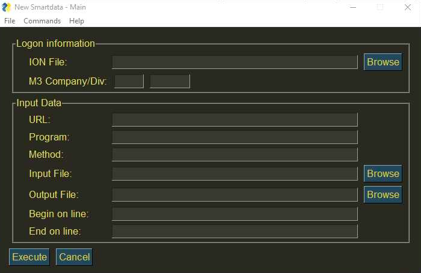

--------------------------
How to install for MacOS
--------------------------

When talking about a MacOS, the right way of installing the **New Smartdata App** is by downloading the zip folder. After downloading it, you need to open your terminal (MacOS) to follow these simple instruptions for *unzipping the folder*.
One step at a time, you should:
::

    cd Downloads/
    unzip NewSmartdata.app.zip
    cd dist/NewSmartdata.app/Contents/MacOS
    ./NewSmartdata

If you followed the steps correctly, you should get an output to wait while downloading.
In a few moments the New Smartdata App window should appear to get things started.

MacOs

----------------------------
How to install for Windows
----------------------------

Now, for Windows computers it is much easier. Just by allowing the download to proceed with the **NewSmartdata.exe**, you should see the window of the app open.

Windows
