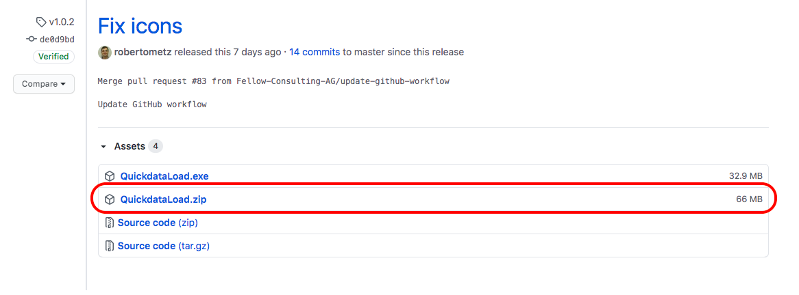
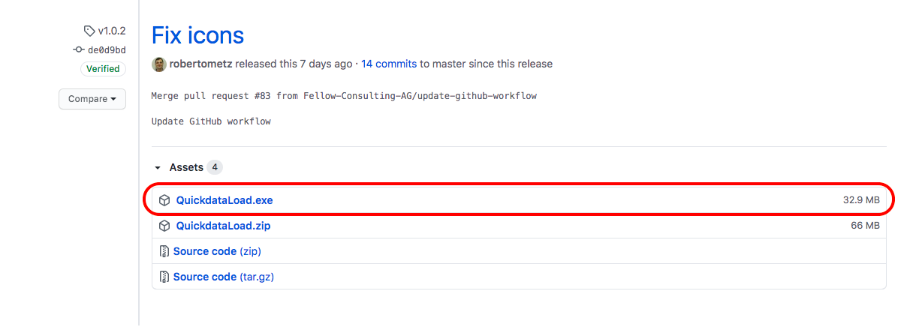
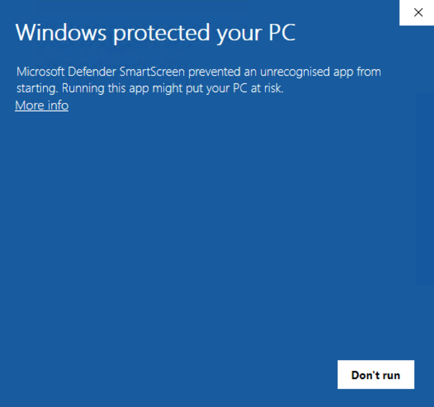
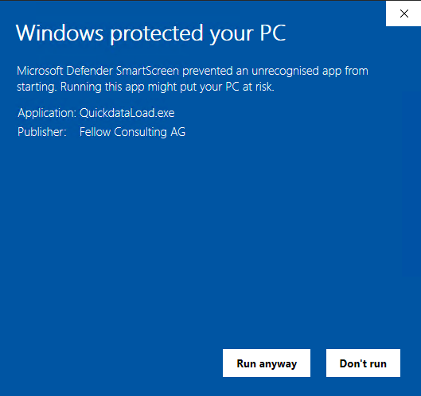

=================
Installation
=================

How to install for MacOS
--------------------------

When talking about a MacOS environment, the right and only way of installing the **QuickdataLoad App** is by downloading the **zip folder**.
Here is the link for the download: QuickdataLoadApp_.

.. _QuickdataLoadApp: https://github.com/Fellow-Consulting-AG/NewSmartdata/releases/tag/v1.0.2

After downloading it, you need to open your terminal (MacOS) to follow these simple instruptions for *unzipping the folder*. That is the easiest way to get to open the App.
One step at a time, you should:
::

    cd Downloads/
    unzip QuickdataLoad.zip
    cd dist/QuickdataLoad.app/Contents/MacOS
    ./QuickdataLoad

If you followed the steps correctly, you should get an output to wait while downloading. In a few moments the QuickdataLoad App window should appear to get things started.

.. image:: images/New_Smartdata.jpg
    :width: 500
    :align: center

How to install for Windows
----------------------------

Now, for Windows environments it is much easier. Here is the link for the download: QuickdataLoadApp_.

.. _QuickdataLoadApp: https://github.com/Fellow-Consulting-AG/NewSmartdata/releases/tag/v1.0.2

After downloading it, it is important to allow the download to proceed with the **QuickdataLoad.exe**. That means that keep the *download*.
Then, the following window should pop up.

In order to get the app running, just click on *More info* and you will get the option of **Run anyway**.

Finally, the **QuickdataLoad App** starts running and the principal window pops up to get work done.

.. image:: images/FirstScreen.png
   :width: 500
   :align: center
