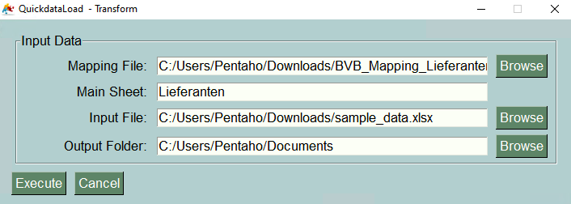

================
Requirements
================

There are just a few requirements that must be considered when running the **QuickdataLoad App**. As we have seen in the *Commands* section, in order to execute every single one of the three described commands (Extract, Transform and Load) some files are highly necessary.

``EXTRACT``
-------------

It is safe to say that the **extract command** is one of the easiest since the required data for extraction is already given by the wide selection of available programs.
The only thing one needs to do, is simply choose where to put the output file.

.. image:: images/ExampleExtract.png
    :width: 500
    :align: center

``TRANSFORM``
---------------

When talking about the **transform command**, some files and documentation are needed beforehand. 
So always take in mind to have these following files for the execution of transforming data:

.. list-table::
   :header-rows: 1

   * - Parameter
     - Description
   * - -a or --mappingfile
     - This parameter is used to provide the mapping file based on which transformation will be done.
   * - -b or --mainsheet
     - This parameter is used to define the main sheet which will contain the mapping fields for transformation.
   * - -i or --inputfile
     - This parameter is used to provide the input data.

``LOAD``
---------

Finally, just as a reminder of all the files that are needed for the **load command**, here is the list again:

+------------------+---------------------------------------------------------------------------------------------------------------------------------------------------------------------+
| Parameter        | Description                                                                                                                                                         | 
+==================+=====================================================================================================================================================================+
| -u, --url        | The full URL to the API is needed. Please note you need to enter the full url like .../M3/m3api-rest/v2/execute/CRS610MI  [required]                                |
+------------------+---------------------------------------------------------------------------------------------------------------------------------------------------------------------+
| -f, --ionfile    | IONFile is needed to login in to Infor OS. Please go into ION and generate a IONFile. If not provided, a prompt will allow you to type the input text. [required]   |
+------------------+---------------------------------------------------------------------------------------------------------------------------------------------------------------------+
| -p, --program    | What kind of program to use by the load  [required]                                                                                                                 | 
+------------------+---------------------------------------------------------------------------------------------------------------------------------------------------------------------+
| -m, --method     | Select the method as a list  [required]                                                                                                                             |
+------------------+---------------------------------------------------------------------------------------------------------------------------------------------------------------------+
| -i, --inputfile  | File to load the data. Please use XLSX or CSV format. If not provided, the input text will just be printed [required]                                               |
+------------------+---------------------------------------------------------------------------------------------------------------------------------------------------------------------+
| -o, --outputfile | File as Output File - Data are saved here for the load                                                                                                              |
+------------------+---------------------------------------------------------------------------------------------------------------------------------------------------------------------+
| -s, --start      | Dataload can be started by 0 or by a number                                                                                                                         | 
+------------------+---------------------------------------------------------------------------------------------------------------------------------------------------------------------+
| -e, --end        | Dataload can be end                                                                                                                                                 |
+------------------+---------------------------------------------------------------------------------------------------------------------------------------------------------------------+
| -z, --configfile | Use a Configfile instead of parameters                                                                                                                              |
+------------------+---------------------------------------------------------------------------------------------------------------------------------------------------------------------+

.. image:: images/TransformExample.png
    :width: 500
    :align: center
