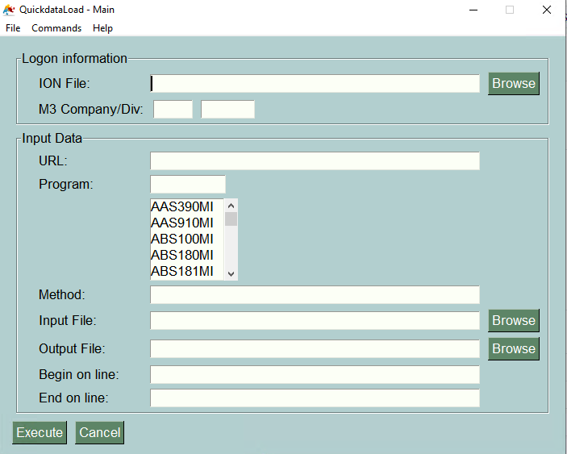
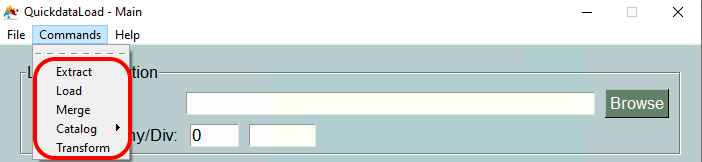
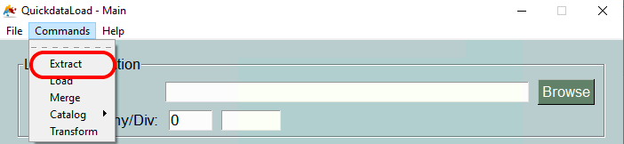
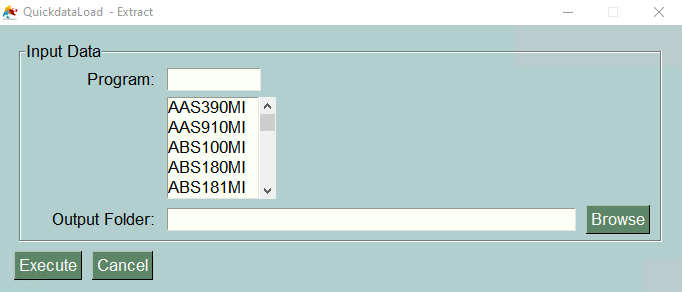
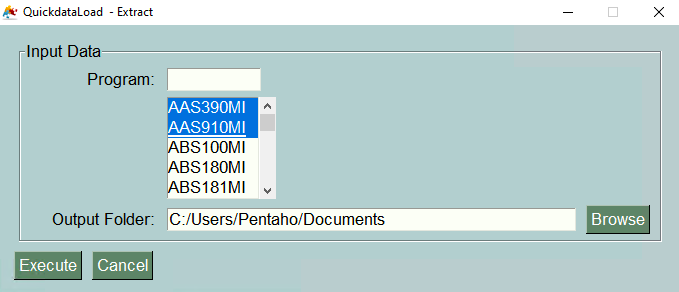
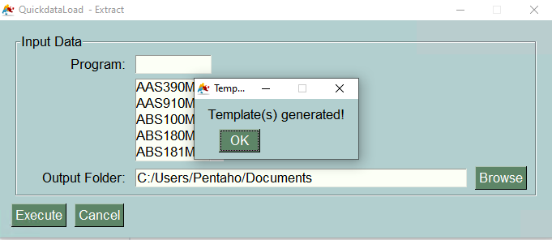
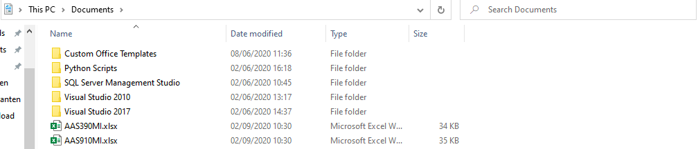
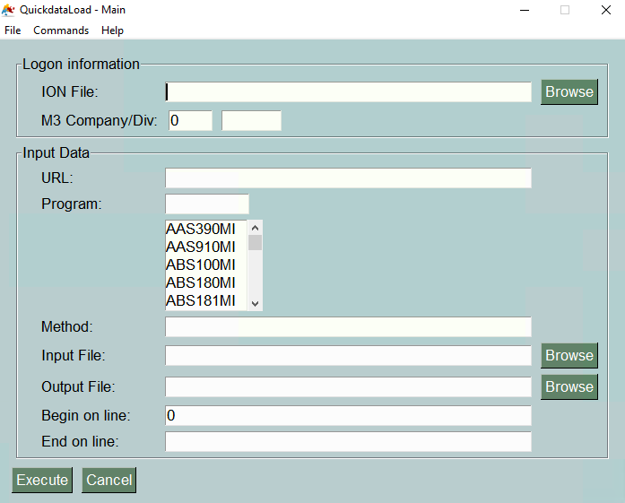

==========
Commands
==========

After installing the **QuickdataLoad App** a new window will appear, as shown below. The main purpose is to be able to execute commands according to the desired Logon information and Input Data. 

Nevertheless, there are various commands available at the upper screen of your MacOs or at the upper part of the app window (Windows), where you can *extract, transform or load* data files.

Now, we are going to go through the three different commands step by step and show how it really works. We will go as follows: **Extract, Transform and Load**.

``EXTRACT``
------------

Starting with the first command: **Extract**. Just click on it on the command options to get things started.

The program is elaborated in a very intuitive way since you just have to decide which *program* you want extract the data from and where (in which directory) you want to save your new outputfile.
For example, we can choose the first two programs for extraction, *"AAS390MI"* and *"AAS910MI"**, and then decide to store the output file in our ``Documents/`` folder.

Finally, just execute the command to get your desired extraction output files in your Documents directory.

That is exactly how the extraction command works!

``TRANSFORM``
---------------

The second command is: **Transform**. 

``LOAD``
----------

The last available command is calles: **Load**. It is the same window as the starting one, but even if it seems more complicated than the others, just following this simple steps will help and guide you.

In order to fill all the information correctly, the following list could give you an heads-up on what each parameter means.

+------------------+---------------------------------------------------------------------------------------------------------------------------------------------------------------------+
| Parameter        | Description                                                                                                                                                         | 
+==================+=====================================================================================================================================================================+
| -u, --url        | The full URL to the API is needed. Please note you need to enter the full url like .../M3/m3api-rest/v2/execute/CRS610MI  [required]                                |
+------------------+---------------------------------------------------------------------------------------------------------------------------------------------------------------------+
| -f, --ionfile    | IONFile is needed to login in to Infor OS. Please go into ION and generate a IONFile. If not provided, a prompt will allow you to type the input text. [required]   |
+------------------+---------------------------------------------------------------------------------------------------------------------------------------------------------------------+
| -p, --program    | What kind of program to use by the load  [required]                                                                                                                 | 
+------------------+---------------------------------------------------------------------------------------------------------------------------------------------------------------------+
| -m, --method     | Select the method as a list  [required]                                                                                                                             |
+------------------+---------------------------------------------------------------------------------------------------------------------------------------------------------------------+
| -i, --inputfile  | File to load the data. Please use XLSX or CSV format. If not provided, the input text will just be printed [required]                                               |
+------------------+---------------------------------------------------------------------------------------------------------------------------------------------------------------------+
| -o, --outputfile | File as Output File - Data are saved here for the load                                                                                                              |
+------------------+---------------------------------------------------------------------------------------------------------------------------------------------------------------------+
| -s, --start      | Dataload can be started by 0 or by a number                                                                                                                         | 
+------------------+---------------------------------------------------------------------------------------------------------------------------------------------------------------------+
| -e, --end        | Dataload can be end                                                                                                                                                 |
+------------------+---------------------------------------------------------------------------------------------------------------------------------------------------------------------+
| -z, --configfile | Use a Configfile instead of parameters                                                                                                                              |
+------------------+---------------------------------------------------------------------------------------------------------------------------------------------------------------------+

Furthermore, it will function exactly like the manual command executed on your Terminal (MacOs) or your Prompt Command (Windows).
At last instance, you can use this command as a tool as well:

::

    inforion load -u https://mingle-ionapi.eu1.inforcloudsuite.com/Tendat_DEV/M3/m3api-rest/v2/execute -f FellowKey.ionapi -p CRS610MI -m "Add,ChgBasicData,ChgOrderInfo,ChgFinancial" -i excel/T-KundenNeu1.xlsx  -o load_full_200.xlsx -s 0 -e 2 
    
.. image:: images/TransformExample.png
    :width: 500
    :align: center

Nevertheless, an important prerequisite in order to achieve the *Loading command* is to already have all the needed parameters on your computer like the ION file, the excel sheets, and so on.
