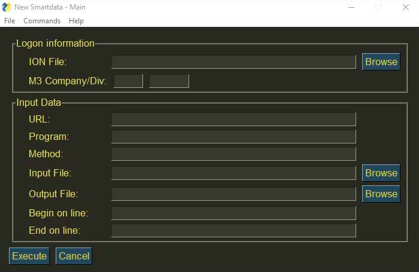

------------------
SmartData App
------------------

After installing the **SmartData Tool App** a new window will appear, as shown below. The main purpose is to be able to execute commands according to the desired Logon information and Input Data. In the Logon Information it is essential that you specify which M3 company and division you are working on.

.. image:: images/New_Smartdata.jpg
    :align: center
MacOs

Windows

Nevertheless, there are various commands available at the upper screen of your MacOs (as shown below) or at the upper part of the app window (Windows), where you can *extract, load or merge* data files.

MacOs

Windows

As an example we can extract data by just choosing the program type and browsing into your computer to allocate the desired output file. That means, the main process of retrieving data out of the program source to an output file will be executed.

.. image:: images/Extract_NewSmartdata.jpg
    :align: center
MacOs

Windows
